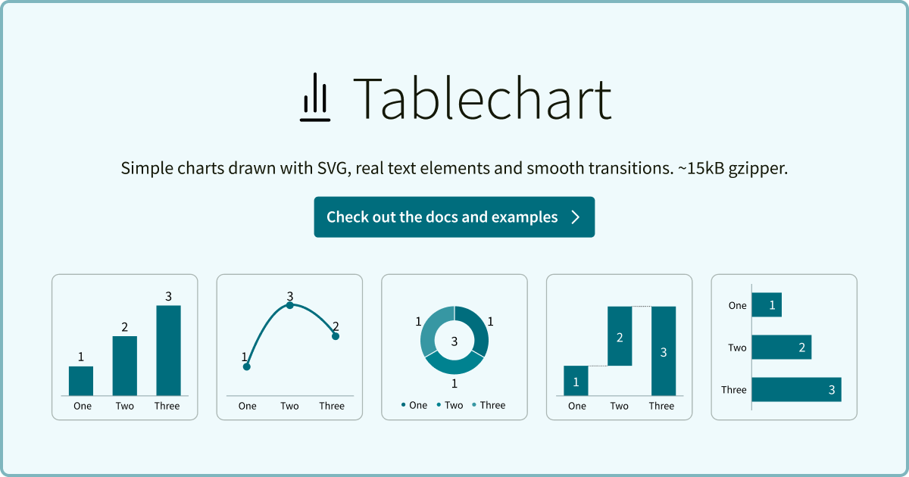

# Tablechart

[](https://www.npmjs.com/package/@martinomagnifico/tablechart)

[](https://martinomagnifico.github.io/tablechart/)

----

## What is it?

Tablechart makes simple charts from a table: an HTML table, a Markdown table or a JSON file. You write the table, Tablechart shows it as a chart.

* **Chart types:** column, bar, line, area, waterfall and donut
* **The table stays:** it is hidden from sight, but screen readers, search engines and translation scripts still read it. Without JavaScript, the table is all there is.
* **Real text:** names and numbers are HTML, so they use the font of the page and do not scale with the drawing.
* **CSS for the looks:** colours, sizes and animation are CSS variables. Light and dark mode follow the page.
* **Annotations:** callouts, brackets, trend arrows and a break in the scale
* **Step by step:** show the rows one at a time, with Previous and Next buttons
* **Animation:** a chart builds when it scrolls into view

----

**Documentation:** every chart type, option and CSS variable, with live examples, is at <https://martinomagnifico.github.io/tablechart/>. This README is a quick start.

----

## Installation

```sh
npm install @martinomagnifico/tablechart
```

```js
import { init } from "@martinomagnifico/tablechart";
import "@martinomagnifico/tablechart/style.css";

init();
```

Or with a script tag:

```html
<link rel="stylesheet" href="tablechart.css">
<script src="tablechart.js"></script>
<script>
	Tablechart.init();
</script>
```

## A chart

A chart is a `figure` with `data-chart` and a table in it. The first cell of a row is its name, the other cells are its values. The `figcaption` is the title; text after a `br` is the subtitle.

```html
<figure data-chart="column">
	<figcaption><b>Apples picked</b><br><span>thousands</span></figcaption>
	<table>
		<tbody>
			<tr><th>Spring</th><td>58</td></tr>
			<tr><th>Summer</th><td>72</td></tr>
			<tr><th>Autumn</th><td>70</td></tr>
		</tbody>
	</table>
</figure>
```

Use `bar`, `line`, `area`, `waterfall` or `donut` for the other types. With more than one value column, each column is a line, or a bar in each group. Add `data-chart-stack` to stack them.

## Options

```js
init({
	animate: true,      // Animate a chart when it builds: true, false, "across" or "up"
	threshold: 0.5,     // How much of a chart must be in view before it builds
	replay: false,      // Build again each time a chart scrolls back into view
	controls: true,     // Previous and Next buttons on a chart that steps
	locale: undefined,  // Locale for numbers; the language of the page if not set
});
```

Most options can also be set on one chart with a `data-chart-*` attribute. All options are in the [options reference](https://martinomagnifico.github.io/tablechart/reference/options.html).

## API

`init()` returns `{ charts, refresh, destroy }`. `refresh()` lays out every chart again. `destroy()` stops watching scroll, size and language changes.

To make a chart of one element, use `create()`. Each chart is also on its element, as `element.tablechart`.

```js
import { create } from "@martinomagnifico/tablechart";

const chart = await create(document.querySelector("#sales"));
chart.refresh();
```

For a script that decides itself when a chart builds, `@martinomagnifico/tablechart/core` has the separate steps. See the [API reference](https://martinomagnifico.github.io/tablechart/reference/api.html).

## Styling

Tablechart uses the colours of the page. To change them, set CSS variables on a chart or on a parent:

```css
.sales {
	--tablechart-bar-color: teal;
	--tablechart-value-size: 1.2em;
}
```

All variables are in the [CSS variables reference](https://martinomagnifico.github.io/tablechart/reference/variables.html).

## Reveal.js

For charts in a Reveal.js presentation, with fragments that step a chart, use [reveal.js-tablechart](https://github.com/Martinomagnifico/reveal.js-tablechart).

Tablechart is free and open source. If it saves you time, consider [sponsoring my work](https://ko-fi.com/martinomagnifico).

## License

MIT © [Martinomagnifico](https://github.com/martinomagnifico)
